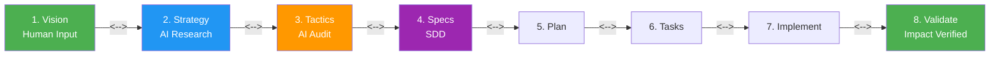
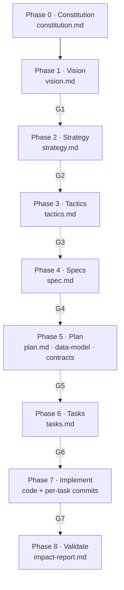
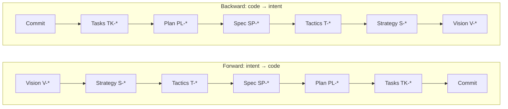
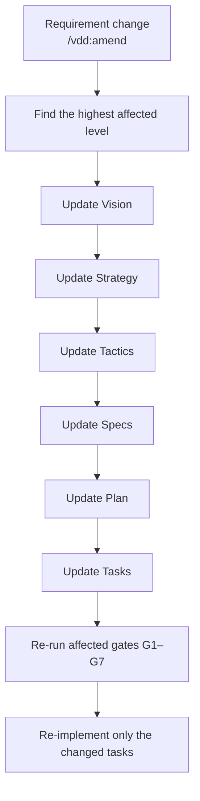

# Vision Driven Design

<!-- mcp-name: io.github.simonmak-ascent/vision-driven-design -->

> **From vision to verified impact** — an AI-native, fully autonomous software development methodology.

[](https://github.com/simonmak-ascent/vision-driven-design/actions/workflows/vdd-quality-gates.yml)
[](https://github.com/simonmak-ascent/vision-driven-design/actions/workflows/tdqs.yml)
[](https://registry.modelcontextprotocol.io/v0/servers?search=io.github.simonmak-ascent/vision-driven-design)
[](https://glama.ai/mcp/servers/simonmak-ascent/vision-driven-design)
[](https://agentstatus.dev/mcp-index/vdd)
[](https://github.com/simonmak-ascent/vision-driven-design/releases)
[](https://vdd.simonmak.com/api/mcp)
[](https://vdd.simonmak.com)
[](LICENSE)

## Overview

Provide a human vision statement. The AI autonomously researches, audits your codebase, generates specs and plans, implements, and validates — with **bi-directional verification** at every junction to ensure nothing is missed or invented.

---



---

## Table of Contents

- [Quick Start](#quick-start)
- [How It Works](#how-it-works)
- [Commands](#commands)
- [Installation](#installation)
- [MCP API](#mcp-api)
- [Domains Covered](#domains-covered)
- [Best-Practice Benchmark](#best-practice-benchmark)
- [Documentation](#documentation)
- [Repository Structure](#repository-structure)
- [Credits](#credits)
- [License](#license)

---

## Quick Start (≤ 5 minutes)

**Fastest path:** no install — connect an MCP client to the hosted endpoint
`https://vdd.simonmak.com/api/mcp` (Streamable HTTP); or run the one-line install below.

```bash
# One-line install
curl -sSL https://raw.githubusercontent.com/simonmak-ascent/vision-driven-design/main/scripts/install.sh | bash
```

Then in your project:

```bash
/vdd:init                          # Generate project constitution
/vdd:vision "your vision here"     # The only human input required

# Or run end-to-end in one command:
/vdd:e2e "your vision here"        # Full chain: init→vision→...→validate
```

The AI handles the rest — researching, auditing, generating specs, planning, implementing, and validating — with self-gating at 7 bi-directional verification junctions.

**[Skill reference →](SKILL.md)** — commands, the 8-phase chain, and the quality gates.

```bash
# Want human gates? Add to constitution.md:
## VDD Mode: Gated
```

---

## How It Works

VDD follows Goldratt's **recursive Strategy-Tactic decomposition**: every phase is simultaneously the **Tactic** for its parent and the **Strategy** for its child.

| Phase | S&T Role | Output |
|-------|----------|--------|
| **0. Constitution** | (pre-chain) | `constitution.md` — Immutable project rules |
| **1. Vision** | L1 Strategy: What impact? | `vision.md` — Impact model, success metrics |
| **2. Strategy** | L1 Tactic → L2 Strategy | `strategy.md` — Research, 12 pillars, risk register |
| **3. Tactics** | L2 Tactic → L3 Strategy | `tactics.md` — Codebase audit, 38 action items |
| **4. Specs** | L3 Tactic → L4 Strategy | `spec.md` — MoSCoW acceptance criteria |
| **5. Plan** | L4 Tactic → L5 Strategy | `plan.md`, `data-model.md`, `contracts/` |
| **6. Tasks** | L5 Tactic → L6 Strategy | `tasks.md` — Test-first atomic tasks |
| **7. Implement** | L6 Tactic → L7 Strategy | Code — Per-task commits with full traceability |
| **8. Validate** | L7 Tactic — Did it work? | `impact-report.md` — Drift + impact verification |

**7 bi-directional gates** verify both directions at every junction (108 total checks). Each gate validates 4 S&T assumptions: Necessity, Achievability, Sufficiency, Warnings.

Every code commit traces back to the original vision statement:
```
V-001 → S-002 → T-003 → SP-004 → PL-005 → TK-006 → commit
```

### The pipeline and its 7 gates



### Bi-directional traceability

Each gate checks **forward** (parent → children) and **backward** (children → parent),
108 checks in total.



### Change cascade



---

## Commands

| Command | Phase | Action |
|---------|-------|--------|
| `/vdd:init` | 0 | Generate `constitution.md` from project context |
| `/vdd:vision "statement"` | 1 | Expand freeform vision → structured `vision.md` |
| `/vdd:strategize` | 2 | Load domain primers, spawn research subagents, synthesize `strategy.md` |
| `/vdd:tactics` | 3 | Audit repo → gap analysis → `tactics.md` |
| `/vdd:specify <ID \| "desc">` | 4 | Generate `spec.md` (or freeform — skips V/S/T) |
| `/vdd:clarify <feature>` | 4 | Clarification pass on a spec |
| `/vdd:plan <feature>` | 5 | Generate `plan.md`, `data-model.md`, `contracts/` |
| `/vdd:tasks <feature>` | 6 | Generate `tasks.md` |
| `/vdd:get-next-task <feature>` | 7 | Extract next uncompleted task |
| `/vdd:implement <task-id>` | 7 | Execute single task, verify, commit |
| `/vdd:validate` | 8 | Full-chain traceability + drift + impact report |
| `/vdd:trace` | any | Bidirectional traceability matrix |
| `/vdd:analyze <feature>` | any | Cross-artifact consistency analysis |
| `/vdd:amend "what changed"` | any | Cascade requirement change through full chain |
| `/vdd:detect-environment` | any | Report per-phase tool/MCP requirements + available capabilities |
| `/vdd:e2e "vision statement"` | 0–8 | **End-to-end**: run full 8-phase chain in one call, writes all 10+ template files |
| `/vdd:e2e -clone <domain>` | 7 | **Clone**: crawl site (browserless/fetch) into a full dataset + exact UI/UX + rebuilt backend + generated schema + AI tools + deployable dynamic site (vdd/clone-site/) from a domain (https/http/www/bare) |

---

## Installation

```bash
# OpenCode
git clone https://github.com/simonmak-ascent/vision-driven-design.git \
  ~/.config/opencode/skills/vision-driven-design/

# Claude Code
git clone https://github.com/simonmak-ascent/vision-driven-design.git \
  ~/.claude/skills/vision-driven-design/

# Cursor
git clone https://github.com/simonmak-ascent/vision-driven-design.git \
  .cursor/skills/vision-driven-design/
```

### Local MCP (from source)

To run the MCP server locally (stdio) instead of the hosted endpoint:

```bash
# 1. Clone the repo
git clone https://github.com/simonmak-ascent/vision-driven-design.git

# 2. Install deps + build the TypeScript packages
cd vision-driven-design
pnpm install
pnpm -r build

# 3. Point your agent at the built stdio entry point
```

**OpenCode** (`opencode.json`):
```json
"vdd": {
  "type": "local",
  "command": ["node", "<repo>/packages/vdd-mcp/dist/stdio.js"],
  "enabled": true
}
```

**Claude Desktop** (`claude_desktop_config.json`):
```json
"vdd": {
  "command": "node",
  "args": ["<repo>/packages/vdd-mcp/dist/stdio.js"],
  "type": "stdio"
}
```

---

## MCP API

VDD is available as a public MCP server at `https://vdd.simonmak.com` — 15 tools, no API key required — over the MCP **Streamable HTTP** transport at `https://vdd.simonmak.com/api/mcp` (also reachable at `/mcp`). The legacy SSE endpoint is retired: `https://vdd.simonmak.com/api/sse` now returns an HTTP 308 redirect to `/api/mcp`.

### Agent Configuration

**OpenCode** — add to `opencode.json`:
```json
"vdd": {
  "type": "remote",
  "url": "https://vdd.simonmak.com/api/mcp",
  "timeout": 120000
}
```

**Claude Desktop** — add to `claude_desktop_config.json`:
```json
"vdd": {
  "command": "npx",
  "args": ["-y", "@simonmak-ascent/mcp"],
  "type": "stdio"
}
```

**Cursor** — add MCP server URL: `https://vdd.simonmak.com/api/mcp`

**Any Streamable HTTP client** (Smithery, Claude Code, …) — MCP server URL: `https://vdd.simonmak.com/api/mcp`

### MCP Tools (15)

`vdd_init`, `vdd_vision`, `vdd_strategize`, `vdd_tactics`, `vdd_specify`, `vdd_clarify`, `vdd_plan`, `vdd_tasks`, `vdd_get_next_task`, `vdd_implement`, `vdd_validate`, `vdd_inspect`, `vdd_amend`, `vdd_clone`, `vdd_detect_environment`.

The one-call `e2e` shortcut is not an MCP tool (it duplicates the phase sequence); use the CLI `vdd e2e "vision"` instead.

Each tool advertises only the parameters it reads. Shared inputs include `statement`, `projectRoot`, `actionItemId`, `feature`, `taskId`, `description`, and `availableTools`/`capabilities` (aliases) plus `researchFindings`. Filesystem-dependent tools additionally accept `artifactFiles` (path→content) — and `vdd_tactics` accepts `codebaseAudit` — for the hosted endpoint.

### Hosted vs local (filesystem)

The hosted endpoint (`https://vdd.simonmak.com/api/mcp`) is **stateless and has no filesystem**. It returns artifacts and, for filesystem-dependent phases, a **delegation envelope** for the calling agent to execute locally:

- Artifact-producing phases (`vdd_init`, `vdd_vision`, `vdd_strategize`, `vdd_tactics`, `vdd_specify`, `vdd_plan`, `vdd_tasks`, `vdd_validate`, `vdd_clone`) return their content with `persisted: false` and a `writeTargets` list — the agent writes them.
- Read phases (`vdd_tactics`, `vdd_clarify`, `vdd_get_next_task`, `vdd_inspect`, `vdd_validate`, `vdd_implement`) return a `delegation` envelope when given no content; re-call the **same tool** with `artifactFiles` (and `codebaseAudit` for tactics) to receive the real result.

For direct read/write of a local project, run the **local stdio server** instead — `npx -y @simonmak-ascent/mcp` (see [Local MCP](#local-mcp-from-source)). It performs real filesystem I/O and returns `mode: "local"`, `persisted: true`.


### MCP Prompts (3)

`start_vdd_project` (vision → validated task list), `implement_next_task` (one test-first task with traceability) and `change_requirement` (cascade a change and re-run the gates). Available on the stdio server and the hosted endpoint.

### MCP Registry (Glama)

The server is listed on [Glama](https://glama.ai/mcp/servers/simonmak-ascent/vision-driven-design), which builds it from source and publishes a hosted remote endpoint plus a **Tool Definition Quality Score** and maintenance rating:

<a href="https://glama.ai/mcp/servers/simonmak-ascent/vision-driven-design"></a>

Maintainer notes:

- `glama.json` (repo root) is Glama's registry file. Its [schema](https://glama.ai/mcp/schemas/server.json) consumes exactly one field — `maintainers`. Build/transport/description metadata belongs in `package.json` and this README, **not** here; Glama ignores it.
- Glama generates its own container build from the stdio entrypoint (`packages/vdd-mcp/dist/stdio.js`), wrapped with `mcp-proxy`. The root `Dockerfile` is for **self-hosting** the Streamable HTTP server, not for Glama.
- After tool-definition changes: sync the repository and run **Build & Release** in the Glama admin. Tool-level scores refresh on the next sweep; the server-level *coherence* score re-runs less often.
- Also published to the [**Official MCP Registry**](https://registry.modelcontextprotocol.io) as `io.github.simonmak-ascent/vision-driven-design` (manifest: `server.json`) — PulseMCP and other directories ingest from there.
- Listed in the [`awesome-mcp-servers`](https://github.com/punkpeye/awesome-mcp-servers) community list under Developer Tools.
- Listed on [**Agent Status**](https://agentstatus.dev/mcp-index/vdd) — an outside-in MCP reliability index that probes reach, catalog, and tool calls from real hosts (Cursor, Claude, VS Code, ChatGPT). The submission created the Free dashboard account; the score populates after the first probe.

  <a href="https://agentstatus.dev/mcp-index/vdd"></a>

### API Reference

| Method | Description |
|--------|-------------|
| POST `/api/mcp` | Streamable HTTP — JSON-RPC `initialize`, `tools/list`, `tools/call` (stateless) |
| GET `/api/mcp` | HTML docs page for browsers; 405 for MCP clients (no server-initiated stream) |
| DELETE `/api/mcp` | 204 — no session state to terminate |
| `/api/sse` | Retired — HTTP 308 redirect to `/api/mcp` |

```bash
# Streamable HTTP call example
curl -X POST https://vdd.simonmak.com/api/mcp \
  -H "Content-Type: application/json" \
  -H "Accept: application/json, text/event-stream" \
  -d '{"jsonrpc":"2.0","id":1,"method":"tools/list"}'
```

```bash
# tools/call example
curl -X POST https://vdd.simonmak.com/api/mcp \
  -H "Content-Type: application/json" \
  -d '{"jsonrpc":"2.0","method":"tools/call","params":{"name":"vdd_validate","arguments":{"projectRoot":"."}},"id":1}'
```

The full TypeScript engine (`packages/vdd-engine`, `packages/vdd-mcp`, `packages/vdd-cli`) is included in this repo.

---

## Domains Covered

VDD loads domain-specific research patterns during the Strategy phase based on your vision:

| Domain | What it covers |
|--------|---------------|
| **WebApp** | UX, accessibility (WCAG 2.2), performance budgets, framework evaluation |
| **Data Storage** | Schema design, indexing strategy, data governance, ACID vs eventual |
| **ETL** | Pipeline architecture, data quality, batch vs streaming |
| **Infrastructure** | CI/CD, observability, security, scaling, disaster recovery |
| **Human Factors** | Behavioral economics, cognitive load, habit formation, accessibility cognition |
| **Verification Toolchain** | Playwright, Browserless, Sentry, CI/CD quality pipeline |
| **Safety-Critical** | FMEA/FTA, DO-178C/IEC 62304 safety integrity levels |

`human-factors.md` and `verification-toolchain.md` are loaded unconditionally for every project.

---

## Best-Practice Benchmark

VDD is benchmarked against NASA SE, CMMI REQM, DO-178C, IEC 62304, DORA, ISO 29148, and GitHub Spec Kit:

**47/47 criteria matched (100%), 11 exceeded, 0 gaps.**

[Standards & compliance evidence →](references/compliance-evidence.md)

---

## Documentation

| File | Contents |
|------|----------|
| [`SKILL.md`](SKILL.md) | Full command reference and workflow |
| [`docs/deployment.md`](docs/deployment.md) | Local stdio / HTTP / hosted modes and the delegation contract |
| [`references/workflow-phases.md`](references/workflow-phases.md) | Step-by-step phase instructions (authoritative) |
| [`references/artifact-templates.md`](references/artifact-templates.md) | Copy-paste templates for all 11 artifacts |
| [`references/quality-gates.md`](references/quality-gates.md) | 7 gates with 108 checks + CI/CD |
| [`references/anti-patterns.md`](references/anti-patterns.md) | 24 failure modes and fixes |
| [`references/compliance-evidence.md`](references/compliance-evidence.md) | DO-178C/IEC 62304/CMMI/ISO 29148 evidence maps |
| [`references/clone-workflow.md`](references/clone-workflow.md) | Website cloning — crawl → dataset → deployable dynamic site |
| [`references/quick-reference.md`](references/quick-reference.md) | One-page cheat sheet |

---

## Repository Structure

```
├── SKILL.md                         # Entry point — loaded by OpenCode
├── README.md                        # This file
├── AGENTS.md                        # Instructions for AI agents
├── constitution.md                  # Project constitution (dogfooded)
├── CHANGELOG.md                     # Versioned change history
├── CONTRIBUTING.md                  # Contribution guidelines
├── LICENSE                         # MIT
├── index.html                       # GitHub Pages landing page
├── pnpm-workspace.yaml              # Workspace config
├── package.json                     # Root package (Vercel + workspace)
├── vercel.json                      # Vercel deployment config
├── Dockerfile                       # Self-host build — Streamable HTTP MCP server
├── glama.json                       # Glama registry file (maintainers only)
├── server.json                      # Official MCP Registry manifest
├── domain-primers/                  # 7 domain research patterns
│   ├── webapp.md
│   ├── data-storage.md
│   ├── etl.md
│   ├── infrastructure.md
│   ├── human-factors.md             # Loaded unconditionally
│   ├── verification-toolchain.md    # Loaded unconditionally
│   └── safety-critical.md           # FMEA/FTA, DO-178C/IEC 62304
├── references/                      # 10 authoritative reference docs
│   ├── INDEX.md                     # Navigation map
│   ├── quick-reference.md           # 1-page cheat sheet
│   ├── workflow-phases.md           # Phase order (authoritative)
│   ├── artifact-templates.md        # 11 artifact templates (authoritative)
│   ├── prompt-patterns.md           # AI prompts (authoritative)
│   ├── quality-gates.md             # 7 gates + 108 checks (authoritative)
│   ├── ai-agent-patterns.md         # Agent orchestration (authoritative)
│   ├── anti-patterns.md             # 24 failure modes (authoritative)
│   ├── traceability-matrix.md       # RTM format + CI/CD
│   └── compliance-evidence.md       # Evidence maps
├── vdd/                             # VDD chain artifacts
│   ├── vision.md                    # Vision, impact model, 17 impacts
│   ├── strategy.md                  # 12 strategic pillars
│   ├── tactics.md                   # 38 action items (all DONE)
│   ├── impact-report.md             # Full-chain traceability + drift
│   ├── docs/                        # 16 guides and references
│   └── specs/                       # 3 feature specs
├── packages/                        # TypeScript monorepo
│   ├── vdd-engine/                  # Shared core — 18 phase functions + meta.ts
│   ├── vdd-mcp/                     # MCP server — 15 tools, stdio + Streamable HTTP
│   └── vdd-cli/                     # CLI binary — 17 subcommands
├── api/                             # Vercel MCP endpoint
│   ├── mcp.js                       # Streamable HTTP MCP endpoint (15 tools)
│   └── _vdd-rpc.js                  # Shared JSON-RPC core + browser docs page (not routed)
├── scripts/                         # 4 installer/helper scripts
└── .github/                         # GitHub config
    ├── CODEOWNERS
    ├── ISSUE_TEMPLATE/
    └── workflows/
```

## Acknowledgements

Built on:
- **Goldratt's Strategy-and-Tactic Tree** — recursive decomposition at every phase
- **Impact Mapping** (Gojko Adzic) — goal → actors → impacts → deliverables
- **GitHub Spec Kit** — spec-driven development with AI agents
- **NASA Systems Engineering** — bidirectional traceability and verification chains
- **CMMI Requirements Management** — bidirectional traceability of requirements

## Use with Context7

Up-to-date Vision Driven Design documentation is indexed on [Context7](https://context7.com/simonmak-ascent/vision-driven-design), so coding agents can pull it into context on demand. With the Context7 MCP server or `ctx7` CLI installed, name the library in your prompt:

```text
use library /simonmak-ascent/vision-driven-design for API and docs
```

## License

MIT — see [LICENSE](LICENSE).

---

By [Simon Mak](https://github.com/simonmak-ascent).

If this saves you time, a ⭐ on GitHub helps others find it.
